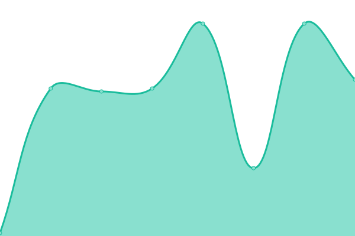

# [📈 Live Status](https://reduct-inc.github.io/dev-status): <!--live status--> **🟩 All systems operational**

This repository contains the open-source uptime monitor and status page for [Reduct, Inc](https://reduct-inc.github.io/dev-status), powered by [Upptime](https://github.com/upptime/upptime).

With [Upptime](https://upptime.js.org), you can get your own unlimited and free uptime monitor and status page, powered entirely by a GitHub repository. We use [Issues](https://github.com/reduct-inc/dev-status/issues) as incident reports, [Actions](https://github.com/reduct-inc/dev-status/actions) as uptime monitors, and [Pages](https://reduct-inc.github.io/dev-status) for the status page.

<!--start: status pages-->
<!-- This summary is generated by Upptime (https://github.com/upptime/upptime) -->
<!-- Do not edit this manually, your changes will be overwritten -->
<!-- prettier-ignore -->
| URL | Status | History | Response Time | Uptime |
| --- | ------ | ------- | ------------- | ------ |
|  [dev status](https://dev.distill.video) | 🟩 Up | [dev-status.yml](https://github.com/reduct-inc/dev-status/commits/HEAD/history/dev-status.yml) | 

 340ms
     
 | 

<a href="https://reduct-inc.github.io/dev-status/history/dev-status">100.00%</a>
    

|  [dev servers status](https://dev.distill.video/x/status) | 🟩 Up | [dev-servers-status.yml](https://github.com/reduct-inc/dev-status/commits/HEAD/history/dev-servers-status.yml) | 

 63ms
     
 | 

<a href="https://reduct-inc.github.io/dev-status/history/dev-servers-status">100.00%</a>
    

|  [dev transcripts status](https://dev.distill.video/x/tsss/status) | 🟩 Up | [dev-transcripts-status.yml](https://github.com/reduct-inc/dev-status/commits/HEAD/history/dev-transcripts-status.yml) | 

 63ms
     
 | 

<a href="https://reduct-inc.github.io/dev-status/history/dev-transcripts-status">100.00%</a>
    

|  [dev rendering status](https://dev.distill.video/x/render/status) | 🟩 Up | [dev-rendering-status.yml](https://github.com/reduct-inc/dev-status/commits/HEAD/history/dev-rendering-status.yml) | 

 68ms
     
 | 

<a href="https://reduct-inc.github.io/dev-status/history/dev-rendering-status">100.00%</a>
    

|  [dev live transcripts status](https://dev.distill.video/x/live-transcription/status) | 🟩 Up | [dev-live-transcripts-status.yml](https://github.com/reduct-inc/dev-status/commits/HEAD/history/dev-live-transcripts-status.yml) | 

 61ms
     
 | 

<a href="https://reduct-inc.github.io/dev-status/history/dev-live-transcripts-status">100.00%</a>
    

|  [dev transcript processing status](https://dev.distill.video/x/whisper/status) | 🟩 Up | [dev-transcript-processing-status.yml](https://github.com/reduct-inc/dev-status/commits/HEAD/history/dev-transcript-processing-status.yml) | 

 53ms
     
 | 

<a href="https://reduct-inc.github.io/dev-status/history/dev-transcript-processing-status">100.00%</a>
    

<!--end: status pages-->

[**Visit our status website →**](https://reduct-inc.github.io/dev-status)

## 📄 License

- Powered by: [Upptime](https://github.com/upptime/upptime)
- Code: [MIT](./LICENSE) © [Anand Chowdhary](https://anandchowdhary.com), supported by [Pabio](https://pabio.com)
- Data in the `./history` directory: [Open Database License](https://opendatacommons.org/licenses/odbl/1-0/)
